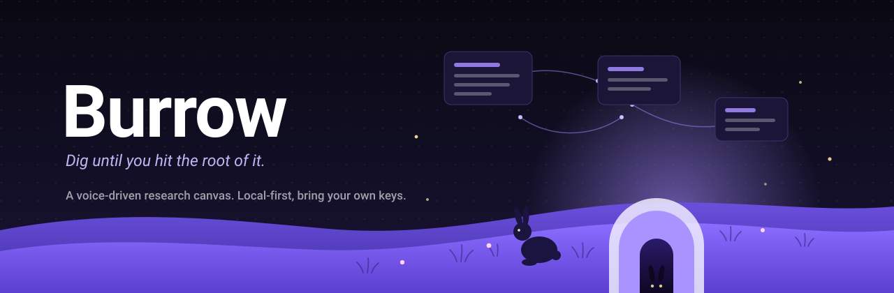

<p align="center">
  
</p>

<p align="center">
  <a href="https://deepwiki.com/ronak-create/burrow"></a>
</p>

A voice-driven AI research assistant on an infinite canvas — a "digital detective board" for going deep on a topic. Bring your own documents, talk to an assistant that can search, fetch papers, write notes, build diagrams and tables, generate images, and lay it all out on the board with you.

**Local-first and BYOK.** Canvases, documents, and conversation transcripts are plain files on your own disk. You supply your own API keys for whichever providers you want; they are stored in your OS keychain and nothing leaves your machine except the calls you configure.

## Docs

- [`DESIGN.md`](./DESIGN.md) — the full design, the decisions behind it, and what is deliberately deferred. Written by hand, and the place to start.
- [DeepWiki](https://deepwiki.com/ronak-create/burrow) — a generated tour of the codebase, and a question box you can ask about it. Machine-written from the source, so it is a map rather than an authority: where it and `DESIGN.md` disagree, the design doc is the one someone meant.

## Status

Usable, and free to run. The assistant loop is verified against live providers,
every block type in the toolbar is real, documents can be imported and read, and
papers can be searched across four open indexes.

**Working**

- Workspaces as plain folders on disk, pinnable, with global search across every
  board and transcript
- Canvas with note, text, shape, frame, table, diagram, doc and image blocks —
  drawn onto the canvas rather than dropped at the viewport centre
- Freehand ink and eraser, and one undo stack shared by you and the assistant
- Assistant with fifteen tools: write blocks, connect them, frame them, flag what
  it is unsure about, read your documents, read your handwriting, search the
  literature and the web, and generate images
- Documents: PDF, Word, Markdown and text imported into the workspace, read
  in-app, and excerpted onto the board
- Web search and image generation, both BYOK and both provider-agnostic — including
  a custom OpenAI-compatible endpoint, so a local image server works the same way a
  local model does
- Always-on listening with a wake word, an idle sleep back to wake-word-only,
  and a persistent indicator that moves with your voice so it is never a guess
  whether the microphone is live
- Voice input against a Whisper server on your own machine — whisper.cpp,
  Speaches, LocalAI or vLLM — with a hosted provider as the alternative, not the
  requirement
- BYOK keys in the OS keychain, or **no keys at all** — point it at Ollama or any
  OpenAI-compatible endpoint and the whole thing runs locally
- Light/dark, monochrome by default, with an optional accent

**Not built yet**

- A bundled speech engine. Local transcription talks to a Whisper server you run;
  no binary or model file ships in the installer.

## Stack

- **Shell** — Tauri v2 (Rust + WebView2/WKWebView). Chosen over a browser app for real filesystem access, OS-keychain key storage, background wake-word listening, and because Tauri's HTTP client is not CORS-bound, which removes the need for any relay proxy.
- **Canvas** — [React Flow](https://github.com/xyflow/xyflow) (`@xyflow/react`), MIT. Every block is a plain React component, and board state *is* `{nodes, edges}` JSON — which doubles as the file format and as the assistant's structured view of the board.
- **Frontend** — React 19 + Vite + TypeScript.

## Requirements

- Node 20+, Rust (stable, MSVC toolchain on Windows), and the platform's webview runtime
- Windows: Visual Studio Build Tools with the C++ workload, plus the WebView2 runtime

## Develop

```bash
npm install
npm run tauri dev     # run the app
npm test              # unit tests (command layer / undo)
npx tsc --noEmit      # type-check
```

`npm run dev` alone serves the frontend but cannot run the app: the workspace
layer calls into Rust, which only exists inside the Tauri shell. In a browser tab
the first call fails with `Cannot read properties of undefined (reading 'invoke')`.

**Running with no API key.** Install [Ollama](https://ollama.com), pull a model
that supports tool calling, and Burrow will find it — Settings defaults to
`http://127.0.0.1:11434/v1`, and **Detect** lists what you have. A model without
tool-calling support can hold a conversation but cannot touch the board.

Voice works the same way. Spoken replies use your OS voices and never needed a
key; voice *input* now defaults to a local Whisper server at
`http://127.0.0.1:8080/v1`. Anything that speaks the OpenAI audio API will do —
[Speaches](https://github.com/speaches-ai/speaches),
[LocalAI](https://github.com/mudler/LocalAI), or vLLM — and so will
[whisper.cpp](https://github.com/ggml-org/whisper.cpp)'s bundled `server`, which
predates that API and answers on `/inference` instead:

```bash
./build/bin/whisper-server -m models/ggml-base.en.bin --port 8080
```

Leave the model field blank for whisper.cpp, which serves the one model it was
started with. Recordings are converted to the 16 kHz mono WAV it requires before
they are sent. Groq, OpenAI and Deepgram remain in the picker for anyone who
would rather not run a server.

**Always-on listening.** Off by default — the microphone opens because you asked
it to, not because you installed something. Turn it on in Settings → Voice, or
by clicking the indicator in the assistant panel, and say *"Hey Burrow"*.

The microphone then stays open, but nothing is streamed anywhere: an energy
detector runs locally over the audio and only wakes transcription when someone
actually speaks. After the wake word it listens normally, and drops back to
wake-word-only after an idle period you set. Matching is phonetic, so ordinary
mishearings of the phrase still wake it; if yours is consistently missed, add
what you actually get as a second phrase, separated by a comma.

The indicator is always visible and shows exactly one of: off (still, struck
through — the microphone is released, not muted), waiting for the wake word,
listening, thinking, speaking. In the listening state it moves with your voice.

**If the microphone seems not to work**, Settings → Voice has a *Test microphone*
button. It runs the whole path — capture, speech detection, transcription — and
shows your live level against the threshold that decides what counts as speech,
with a slider to move that threshold. If your normal voice does not cross the
line, nothing else will work, and this is where you find out.

Rust-side checks:

```bash
cd src-tauri && cargo check && cargo test
```

## How it is put together

The load-bearing idea is in `src/canvas/commands.ts`: **every** mutation of the board — from the UI and from the assistant alike — goes through a single `apply(board, command)`. That is what makes the undo stack unified (Ctrl+Z undoes whichever edit happened last, no matter who made it), and it means the assistant's tool schemas are generated from the same command union the UI uses, so the two cannot drift apart.

```
src/
  agent/        the assistant loop, its tools, and paper search
  canvas/       command layer, board store, React Flow host, block components
  providers/    LLM and speech-to-text adapters, and the provider registry
  screens/      workspace browser, canvas, settings, document reader
  workspace/    workspace file I/O and autosave
src-tauri/src/
  workspace.rs  workspace folders, atomic board writes, transcripts, search
  documents.rs  document import and text extraction (PDF, Word, Markdown)
  keys.rs       BYOK keys in the OS keychain
  speech.rs     OS text-to-speech
```

Providers are a factory, not a file each: `providers/llm/openai.ts` exports
`openAICompatible({url, models})`, and OpenAI, Groq, Cerebras and the custom
endpoint are all configuration over it. Adding another compatible gateway is a
config object.

A workspace is a self-contained folder you own:

```
<Documents>/Burrow/<id>/
  workspace.json     metadata
  board.json         { nodes, edges, ink, viewport }
  transcript.jsonl   append-only, text only — never audio
  documents/
  images/
```

## License

MIT — see [LICENSE](LICENSE). Every dependency in the canvas stack is permissively licensed too, so anyone can clone, run and self-host this without needing a license of their own.
 